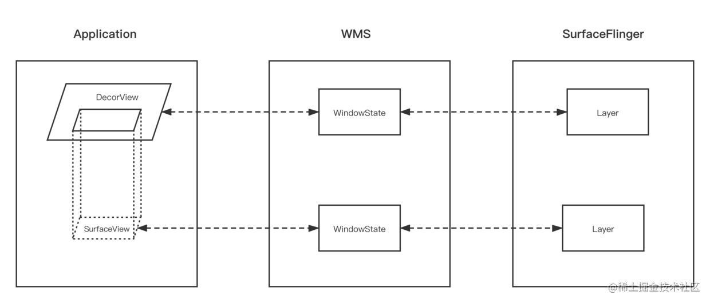
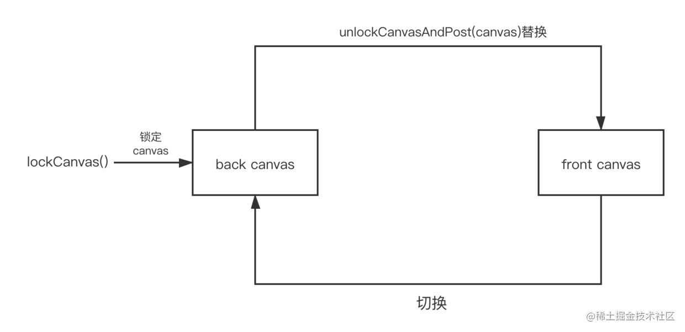

## SurfaceView
- 优点：Surface的渲染可以放到单独线程去做，渲染复杂的动画不会影响主线程的的响应。
- 缺点：因为这个Surface不在View hierachy中，它的显示也不受View的属性控制，所以不能进行平移，缩放等变换，也不能放在其它ViewGroup中，一些View中的特性也无法使用。

## TextureView
- 优点：支持移动、旋转、缩放等动画，支持截图
- 缺点：必须在硬件加速的窗口中使用，占用内存比SurfaceView高，在5.0以前在主线程渲染，5.0以后有单独的渲染线程。

## TextureView和SurfaceView的优缺点汇总

|  | SurfaceView | TextureView |
|--|--|--|
|内存|低|高|
|耗电|低|高|
|绘制效率|及时|1 ~ 3帧的延迟｜
|截图|不支持|支持|
|动画|不支持|支持|

## 什么是surface
在SDK的文档中，对Surface的描述是这样的：“Handle onto a raw  buffer that is being managed by the screen compositor”，翻译成中文就是“由屏幕显示内容合成器(screen compositor)所管理的原始缓冲区的句柄”

简单来说就是，Surface对应了一块屏幕缓冲区，每个window对应一个Surface，任何View都要画在Surface的Canvas上（后面有原因解释）。传统的view共享一块屏幕缓冲区，所有的绘制必须在UI线程中进行。

surface中的canvas就是专门用来画图的，缓冲区是用来保存数据的，而surface就是一个句柄，得到surface就可以得到画图的canvas和保存数据的缓冲区

说完surface就可以说SurfaceView了。 SurfaceView就是指一个在表层的View对象。为什么说是表层呢，因为你说它是一个纯粹view也许不够严谨，它有自己的Surface。有自己的Surface，在WMS中有对应的WindowState，在SurfaceFlinger中有Layer。我们知道，一般的Activity包含的多个View会组成View hierachy的树形结构，只有最顶层的DecorView，也就是根结点视图，才是对WMS可见的。这个DecorView在WMS中有一个对应的WindowState。相应地，在SF中对应的Layer。而SurfaceView自带一个Surface，这个Surface在WMS中有自己对应的WindowState，在SF中也会有自己的Layer。虽然在App端它仍在View hierachy中，但在Server端（WMS和SF）中，它与宿主窗口是分离的。这样的好处是对这个Surface的渲染可以放到单独线程去做，渲染时可以有自己的GL context。这对于一些游戏、视频等性能相关的应用非常有益，因为它不会影响主线程对事件的响应。但它也有缺点，因为这个Surface不在View hierachy中，它的显示也不受View的属性控制，所以不能进行平移，缩放等变换，也不能放在其它ViewGroup中，一些View中的特性也无法使用。而且，SurfaceView默认使用双缓冲技术的，它支持在子线程中绘制图像，这样就不会阻塞主线程

解释下双缓冲：

```
可以理解为：SurfaceView在更新视图时用到了两张Canvas，一张frontCanvas和一张backCanvas，每次实际显示的是
frontCanvas，backCanvas存储的是上一次更改前的视图，当使用lockCanvas（）获取画布时，得到的实际上是backCanvas
而不是正在显示的frontCanvas，之后你在获取到的backCanvas上绘制新视图，再unlockCanvasAndPost（canvas）此视图，
那么上传的这张canvas将替换原来的frontCanvas作为新的frontCanvas，原来的frontCanvas将切换到后台作为backCanvas。
例如，如果你已经先后两次绘制了视图A和B，那么你再调用lockCanvas（）获取视图，获得的将是A而不是正在显示的B，之后
你讲重绘的C视图上传，那么C将取代B作为新的frontCanvas显示在SurfaceView上，原来的B则转换为backCanvas。

```

那么SurfaceView的优缺点就很明确了：
```
优点：
可以在一个独立的线程中进行绘制，不会影响主线程
使用双缓冲机制，播放视频时画面更流畅

缺点：
虽然继承自view，但是view的很多属性是用不了的，Surface不在View hierachy中，它的显示也不受View的属性控制，所以不能进行平移，缩放等变换，也不能放在其它ViewGroup中。SurfaceView 不能嵌套使用
```


TextureView 在4.0(API level 14)中引入，与SurfaceView一样继承View，专门用来渲染像视频或OpenGL场景之类的数据的，而且TextureView只能用在具有硬件加速的Window中，如果使用的是软件渲染，TextureView将什么也不显示。也就是说对于没有GPU的设备，TextureView完全不可用

TextureView 可以将内容流直接投影到View中，它可以将内容流直接投影到View中，可以用于实现Live preview等功能。和SurfaceView不同，它不会在WMS中单独创建窗口，而是作为View hierachy中的一个普通View，因此可以和其它普通View一样进行移动，旋转，缩放，动画等变化。值得注意的是TextureView必须在硬件加速的窗口中。它显示的内容流数据可以来自App进程或是远端进程。从类图中可以看到，TextureView继承自View，它与其它的View一样在View hierachy中管理与绘制。TextureView重载了draw()方法，其中主要SurfaceTexture中收到的图像数据作为纹理更新到对应的HardwareLayer中。SurfaceTexture.OnFrameAvailableListener用于通知TextureView内容流有新图像到来。SurfaceTextureListener接口用于让TextureView的使用者知道SurfaceTexture已准备好，这样就可以把SurfaceTexture交给相应的内容源。Surface为BufferQueue的Producer接口实现类，使生产者可以通过它的软件或硬件渲染接口为SurfaceTexture内部的BufferQueue提供graphic buffer。

总结一下TextureView的优缺点:
```
1、在android 7.0上系统surfaceview的性能比TextureView更有优势，支持对象的内容位置和包含的应用内容同步更新，
平移、缩放不会产生黑边。 在7.0以下系统如果使用场景有动画效果，可以选择性使用TextureView
2、由于失效(invalidation)和缓冲的特性，TextureView增加了额外1~3帧的延迟显示画面更新
3、TextureView总是使用GL合成，而SurfaceView可以使用硬件overlay后端，可以占用更少的内存带宽，消耗更少的能量
4、TextureView的内部缓冲队列导致比SurfaceView使用更多的内存
5、SurfaceView： 内部自己持有surface，surface 创建、销毁、大小改变时系统来处理的，通过surfaceHolder 的
callback回调通知。当画布创建好时，可以将surface绑定到MediaPlayer中。SurfaceView如果为用户可见的时候，
创建SurfaceView的SurfaceHolder用于显示视频流解析的帧图片，如果发现SurfaceView变为用户不可见的时候，
则立即销毁SurfaceView的SurfaceHolder，以达到节约系统资源的目的

```


>SurfaceView实现机制
双缓冲机制
TextureView实现机制
TextureView和SurfaceView的优缺点

播放视频或者渲染其他的动画的时候，有两个View组件可供选择，SurfaceView和TextureView，GLSurfaceView是SurfaceView是子类，这儿还是归类到SurfaceView中吧。

## 1.SurfaceView实现机制
SurfaceView继承自View，所以它也是一个View。但是这个View和普通的View有点不同。
SurfaceView有自己的Surface，在Android中，一个View有自己的Surface，在WMS中中就有对应的WindowState，对应在SurfaceFlinger中就有Layer。


一般的Activity包含的多个View会组成View hierachy的树形结构，只有最顶层的DecorView，也就是根结点视图，才是对WMS可见的。这个DecorView在WMS中有一个对应的WindowState。相应地，在SurfaceFlinger中对应的Layer。而SurfaceView自带一个Surface，这个Surface在WMS中有自己对应的WindowState，在SurfaceFlinger中也会有自己的Layer。虽然SurfaceView在Application端它仍在View hierachy中，但在Server端（WMS和SurfaceFlinger）中，它与宿主窗口是分离的。

SurfaceView为什么要这么设计？
**优点:** 这样的好处是对这个Surface的渲染可以放到单独线程去做，渲染复杂的动画不会影响主线程的的响应。
**缺点：** 因为这个Surface不在View hierachy中，它的显示也不受View的属性控制，所以不能进行平移，缩放等变换，也不能放在其它ViewGroup中，一些View中的特性也无法使用。

## 2.双缓冲机制
简单阐述一下：
```
什么是无缓冲
什么是单缓冲
什么是双缓冲
```

不用画布，直接在窗口上进行绘图叫做无缓冲绘图。

用了一个画布，将所有内容都先画到画布上，在整体绘制到窗口上，就该叫做单缓冲绘图，那个画布就是一个缓冲区。

用了两个画布，一个进行临时的绘图，一个进行最终的绘图，这样就叫做双缓冲绘图。

SurfaceView自身就实现了双缓冲，通俗来讲就是有两个缓冲区，一个后台缓冲区和一个前台缓冲区，每次后台缓冲区接受数据，当填充完整后交换给前台缓冲，这样就保证了前台缓冲里的数据都是完整的。
双缓冲：SurfaceView在更新视图时用到了两张Canvas：


frontCanvas：实际显示的canvas
backCanvas：存储的是上一次更改前的canvas


当然效率更好的方法是frontCanvas和backCanvas在每一次绘制完了之后会交换，frontCanvas变成backCanvas，backCanvas变成frontCanvas。


双缓冲的优势非常明显：
```
提高渲染效率
可以避免刷新频率过高而出现的闪烁现象
```


## 3.TextureView实现机制
在Android4.0(API level 14)中引入，与SurfaceView一样继承View，它可以将内容流直接投影到View中，它可以将内容流直接投影到View中，可以用于实现Live preview等功能。


和SurfaceView不同，不在WMS中单独创建窗口，而是作为View hierachy中的一个普通view，因此可以合其他普通View一样进行移动，旋转，缩放，动画等变化。

和SurfaceView不同，TextureView必须在硬件加速的窗口中。

它显示的内容流数据可以来自Application进程或是远端进程。

TextureView继承自View，它与其它的View一样在View hierachy中管理与绘制。TextureView重载了draw()方法，其中主要SurfaceTexture中收到的图像数据作为纹理更新到对应的HardwareLayer中。

**优点：** 支持移动、旋转、缩放等动画，支持截图
**缺点：** 必须在硬件加速的窗口中使用，占用内存比SurfaceView高，在5.0以前在主线程渲染，5.0以后有单独的渲染线程。

## 4.TextureView和SurfaceView的优缺点
优缺点总结如前所述

不过GLSurfaceView是SurfaceView的子类，除了拥有SurfaceView的优点，GLSurfaceView也支持截图和动画操作。
